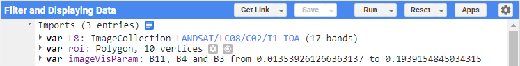
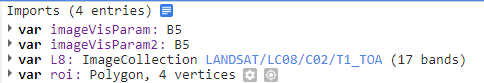
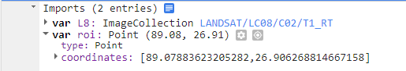
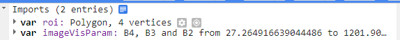

Searching and importing data from a particular image collection, like Landsat 8, from a data
repository or portal like USGS Earth Explorer or NASA Earthdata, does not automatically import 
all data collected by the satellite to date. Instead, it only accesses the metadata and specific 
imagery or datasets that match search criteria.                                             

LANDSAT/LC08/C01/T1 for Landsat 8 contains metadata for all images captured by the satellite. 
The actual images are stored on the server, and you interact with them by querying this metadata.
LANDSAT ---> Broad Satellite Mission/Program
LC08 ---> L ---> Landsat, C ---> Collection, 08 ---> Landsat 8 satellite which carries the Operational 
Land Imager (OLI) and the Thermal Infrared Sensor (TIRS)                                    

C01 ---> Collection 1, processed images to improve quality, like the first edition of a book; using 
mathematical algorithms.
T1 ---> Accessing the highest quality images, suitable for scientific analysis and applications.
----> Useful for time-series analysis.
 
TOA Reflectance: This is a measure of how much sunlight is reflected off the Earth's surface 
and back to the satellite, corrected to account for the atmosphere's effect.
Real-Time Collection (T1_RT): Newly captured images are quickly processed and made available,
but with initial estimates. After more accurate processing, they are moved to the appropriate 
quality tier (Tier 1 or Tier 2).                                        

# Lesson 2


[Click Here](https://youtu.be/4w6Mt6HTC2I?si=dHYy8Oual5L89fpu) Youtube video Link                                                                         

[Click Here](https://code.earthengine.google.com/?scriptPath=users%2Fjeewanrai%2Fjeewan66%3AFilter%20and%20Displaying%20Data) GEE Code Link



```js
//printing directly the L8 will throw error/ can check number of images in collection
// print(L8.size()) // Output: 1805422 images in collection, dont need all the images, filter based on requirement

// // just by looking at Docs we can take in argument to be considered inside of function, create an object
var filtered_roi = L8.filterBounds(roi);
// // filtering data of the data, from data filtering cloud coverage < 1%
// /*ee.FeatureCollection
// filterMetadata(name, operator, value)*/
var filtered_Meta_roi = filtered_roi.filterMetadata('CLOUD_COVER', 'less_than', 1)

print(filtered_Meta_roi.size()) // Output: 42

// //ee.Filter ee.Filter.date(start, end) filter data by specific data
var filtered_Date_Meta_roi = filtered_Meta_roi.filterDate('2024-01-01', '2024-04-30')

print(filtered_Date_Meta_roi.size()) // Output: 0

//Entire above multiple variable assignment method can be made more readable by using following method
```

```js
var Filtered_Collection = L8.filterBounds(roi)
.filterMetadata('CLOUD_COVER', 'less_than', 1)
.filterDate('2023-01-01', '2024-01-01')

var Median_Img = Filtered_Collection.median()

/* From visualization parameters we can manually adjust bands, can import visulization
setting that repeated changing of setting is not required*/
//Map.addLayer(Median_Img)

Map.addLayer(Median_Img, imageVisParam, "Layer")
```                                                                         

# Lesson 3                                                              
[Click Here](https://code.earthengine.google.com/9668f684c11637e9930d95893bad0e55) link of gee code                         
[Click Here](https://youtu.be/euGOBuD460E?si=ZPuv-0Spe3-fpB3N) Youtube link.


```js
// computation with gee, in the Docs type ee.image, there are numerous methods to do computation

// var image1 =ee.Image();
// var image2 = ee.Image();

// var addition = image1.add(image2);

// Best example to do this is to calculate NDVI, amount of greeness
var image = ee.ImageCollection('LANDSAT/LC08/C02/T1_TOA')
.filterBounds(roi)
.filterMetadata('CLOUD_COVER', 'less_than', 1)
.first()
 

 
//Select specific bands from image, select function 
// First method to compute NDVI
var RED = image.select('B4');
var NIR  = image.select('B5');

var NDVI = NIR.subtract(RED).divide(NIR.add(RED));
 
var Clipped_Img = NDVI.clip(roi);
Map.addLayer(Clipped_Img,{}, 'Layer', false)
 
 print(image.bandNames());
//Second method using expression function
var NDVI1 = image.expression(
  '(NIR-RED)/(NIR+RED)',
  {
    // create dictionary
    'NIR': NIR,
    'RED': RED
  }
  )
  
  var Clipped_NDVI1 = NDVI1.clip(roi);
  Map.addLayer(Clipped_NDVI1, imageVisParam2, 'Layer2', false )
  
  
  // Load the Landsat 8 image collection and filter by ROI and cloud cover
var image = ee.ImageCollection('LANDSAT/LC08/C02/T1_TOA')
  .filterBounds(roi)
  .filterMetadata('CLOUD_COVER', 'less_than', 1)
  .first();

// Select specific bands from the image
var RED = image.select('B4');
var NIR = image.select('B5');

// First method to compute NDVI
var NDVI = NIR.subtract(RED).divide(NIR.add(RED)).rename('NDVI');
var clipped_NDVI = NDVI.clip(roi);
Map.addLayer(clipped_NDVI, {}, 'Clipped NDVI', false);

/*palette: ["ff1919","ddff1f","1eff10"]
0: ff1919 ----> Lowest Interms of vegetation cover, Low Cover
1: ddff1f ----> Middest
2: 1eff10 ----> Highest ---> Highly cover*/
// Second method using the expression function
var NDVI1 = image.expression(
  '(NIR - RED) / (NIR + RED)',
  {
    'NIR': NIR,
    'RED': RED
  }
).rename('NDVI');
var clipped_NDVI1 = NDVI1.clip(roi);
Map.addLayer(clipped_NDVI1, {}, 'Clipped NDVI1', false);
```
# Lesson 4
[Click Here](https://code.earthengine.google.com/4b3417fb8fd45ac830ff264e2257448e) link of gee code                         
[Click Here](https://youtu.be/2X9J4waFEtc?si=AyjWy7pWgDAtT1Fo) Youtube link.



```js
/* working on multiple image collection, create a function and map over the collection*/
// L8 --> represents Landsat 8 image collection
// filters specific boundry
// filters image collection with cloud contain less than 1%
var MyCollection = L8.filterBounds(roi).filterMetadata('CLOUD_COVER', 'less_than', 1);

// defined function taking one argument
// select only B4 --> RED, B5 --> NIR
/*calculates the Normalized Difference Vegetation Index (NDVI) using the expression 
(NIR - Red) / (NIR + Red). However, there's a slight error in the formula; it should 
 be (b(1) - b(0)) / (b(1) + b(0))*/
function CalculateNDVI(image)
{
  var selected = image.select('B4', 'B5');
  var NDVI = selected.expression('b(1) - b(0) / b(0) + b(1)').select(['B5'], ['NDVI']);
  return NDVI;
}

// function maps each image and compute NDVI
var NDVIcollection = MyCollection.map(CalculateNDVI);
print(NDVIcollection);

}

```

# Lesson 5
[Click Here](https://code.earthengine.google.com/4b3417fb8fd45ac830ff264e2257448e) link of gee code                         
[Click Here](https://youtu.be/2X9J4waFEtc?si=AyjWy7pWgDAtT1Fo) Youtube link.



### Explination                                             
```js
init: Initial Image
[[0, 0, 0],
 [0, 0, 0],
 [0, 0, 0]]

Day 1 (current image):
Day 1:
[[0, 1, 0],
 [0, 0, 0],
 [1, 0, 1]]

Day 2 (current image):
Day 2:
[[0, 0, 0],
 [1, 0, 1],
 [0, 0, 0]]

Day 3 (current image):
Day 3:
[[1, 1, 0],
 [0, 0, 0],
 [0, 1, 0]]

Mask creation
Mask (Day 1): Mask creation 0 is converted to 1
[[1, 0, 1],
 [1, 1, 1],
 [0, 1, 0]]

Adding Mask
Updated (after adding Mask to init):
[[0+1, 0+0, 0+1],
 [0+1, 0+1, 0+1],
 [0+0, 0+1, 0+0]]

Result:
[[1, 0, 1],
 [1, 1, 1],
 [0, 1, 0]]

Multiply by mask
Updated (after multiplying by Mask):
[[1*1, 0*0, 1*1],
 [1*1, 1*1, 1*1],
 [0*0, 1*1, 0*0]]

Result:
[[1, 0, 1],
 [1, 1, 1],
 [0, 1, 0]]

Updated list Updated (Day 1)
List:
[[[0, 0, 0],
  [0, 0, 0],
  [0, 0, 0]],

 [[1, 0, 1],
  [1, 1, 1],
  [0, 1, 0]]]

Day 2
Mask (Day 2):
[[1, 1, 1],
 [0, 1, 0],
 [1, 1, 1]]

Add mask to last image
Updated (after adding Mask to Last Image):
[[1+1, 0+1, 1+1],
 [1+0, 1+1, 1+0],
 [0+1, 1+1, 0+1]]

Result:
[[2, 1, 2],
 [1, 2, 1],
 [1, 2, 1]]

Multiply mask
Updated (after multiplying by Mask):
[[2*1, 1*1, 2*1],
 [1*0, 2*1, 1*0],
 [1*1, 2*1, 1*1]]

Result:
[[2, 1, 2],
 [0, 2, 0],
 [1, 2, 1]]

Updated list [init, Updated (Day 1), Updated (Day 2)]
List:
[[[0, 0, 0],
  [0, 0, 0],
  [0, 0, 0]],

 [[1, 0, 1],
  [1, 1, 1],
  [0, 1, 0]]],

 [[2, 1, 2],
  [1, 2, 1],
  [1, 2, 1]]

  Day 3
  Mask (Day 3):
[[0, 0, 1],
 [1, 1, 1],
 [1, 0, 1]]

Add mask to last image
Updated (after adding Mask to Last Image):
[[2+0, 1+0, 2+1],
 [0+1, 2+1, 0+1],
 [1+1, 2+0, 1+1]]

Result:
[[2, 1, 3],
 [1, 3, 1],
 [2, 2, 2]]

Multiply mask
Updated (after multiplying by Mask):
[[2*0, 1*0, 3*1],
 [1*1, 3*1, 1*1],
 [2*1, 2*0, 2*1]]

Result:
[[0, 0, 3],
 [1, 3, 1],
 [2, 0, 2]]

 Updated list [init, Updated (Day 1), Updated (Day 2), Updated (Day 3)]
 List:
[[[0, 0, 0],
  [0, 0, 0],
  [0, 0, 0]],

 [[1, 0, 1],
  [1, 1, 1],
  [0, 1, 0]],

 [[2, 1, 2],
  [0, 2, 0],
  [1, 2, 1]],

 [[0, 0, 3],
  [1, 3, 1],
  [2, 0, 2]]]
```

```js
/*Sometime need to calculate in specific order and output of previous calculation 
important for next calculationseverness of drout. Example, to assess severeness of
droughts, compute max amount of consecutive dry days in given year. This is done by
getting dataset  with information about precipitation, and iterating over those images.
When rain is not fallen can be put 0 and not fallen its put 1, contain number of consecutive
dry days*/

var imageCollection = PERSIANN.filterDate('2017-01-01', '2018-01-01');

//counting no. of days particular area didnt receive rainfall, need to starting point
// so create empty image for starting point, meaning zero dry days/ esnsure consistency
/* Every pixel is set to 0, this image is stored in variable init
  Zero Image    Day 1             Day 2
  [0, 0, 0]      [1, 1, 1]      [2, 2, 2]     [3, 3, 3]
  [0, 0, 0] ---> [1, 1, 1] ---> [2, 2, 2] --->[3, 3, 3] --->
  [0, 0, 0]      [1, 1, 1]      [2, 2, 2]     [3, 3, 3]
*/
var init = ee.Image.constant(0) // value does not change/ its kind of band, image of single type pixel
.rename('precipitation')
// simply replacing name does not change underlying data type of the band, (default is floating
// point number (double)), counting number of day its important to use integer value,
// Converts floating point data type to integer type(long)
// working with larger data sets, lont time series count can exceed max value of int\
// can hold, so use long. Cannot fit if we count dry days per minutes 
.cast({'precipitation':'long'});

// iteration(algorithm, first), return computed object
function CalcDryDays(current, previous)
{
  // mask in image procession highlight specific condition/ isolate pixel represent dry days
  // image processed on current step of iteration
  // [0] --> no rainfall, [1] ---> replace 0 in the mask, no rainfall(0) in current image
  // it will replace by 1 in the mask, 1 signify dry day, 0 at the end signify other day
  // that do not meet specified condition, rainfall will be value of 0
  /* 
  Original Data:

Day 1: 0 (no rain)
Day 2: 0 (no rain)
Day 3: 5 (rain)
Day 4: 0 (no rain)
Day 5: 0 (no rain)
Converted Data (Mask):

Day 1: 1 (dry day)
Day 2: 1 (dry day)
Day 3: 0 (rainy day)
Day 4: 1 (dry day)
Day 5: 1 (dry day)
  */
  var Mask = current.remap([0], [1], 0);
  // previous ==> list of images processed so far
  // passing prvious processed image as list for cumulative counting
  // get(-1) retiving last image form list to get the last cumulative count
  // get() function returns generic object, may be image, string, number etc
  // ee.Image convert back to image object  for pixelmanipulation, adding, multiplying, maskingetc
  var LastImage = ee.Image(ee.List(previous).get(-1));
  /*
  Example Scenario
Initial State (LastImage):

Pixel A: 2 (indicating 2 consecutive dry days)
Pixel B: 0 (indicating it rained recently)
Current Mask:

Pixel A: 1 (indicating a dry day)
Pixel B: 0 (indicating a rainy day)
Adding the Mask:

Pixel A: 2 + 1 = 3 (incrementing the dry day count)
Pixel B: 0 + 0 = 0 (count remains unchanged)
Multiplying by the Mask:

Pixel A: 3 * 1 = 3 (dry day count continues)
Pixel B: 0 * 0 = 0 (count is reset due to rain)

dry days are incremented for each consecutive dry dayu
multipying mask to resets rainy days to zero
  */
  var Updated = LastImage.add(Mask).multiply(Mask)
  
  // ee.List ---> converts previous into list object, list of images, processed upto current iteration
  // .add(Updated) ---> adds updaed image to end of the list
  return ee.List(previous).add(Updated);
}

// imageCollction is precipitaiton images over specific period in the form of list
// function is called to iterative over the given imageCollection list
// ee.List([init])--> gives starting point for iteration to start from
var result = ee.List(imageCollection.iterate(CalcDryDays, ee.List([init])))
/*
List of image object == > result
var image1 = ee.Image([
  [0, 1, 0],
  [0, 0, 0],
  [1, 0, 1]
]);

var image2 = ee.Image([
  [0, 0, 0],
  [1, 0, 1],
  [0, 0, 0]
]);

var image3 = ee.Image([
  [1, 1, 0],
  [0, 0, 0],
  [0, 1, 0]
]);

var result = ee.List([
  ee.Image(image1),
  ee.Image(image2),
  ee.Image(image3)
]);

*/
var ResultCollection = ee.ImageCollection(result);
/*
Result of ImageCollection object, comes with image id
ResultCollection = ee.ImageCollection([
  ee.Image({
    id: 'Image1',
    matrix: [[0, 1, 0],
             [0, 0, 0],
             [1, 0, 1]]
  }),
  
  ee.Image({
    id: 'Image2',
    matrix: [[0, 0, 0],
             [1, 0, 1],
             [0, 0, 0]]
  }),
  
  ee.Image({
    id: 'Image3',
    matrix: [[1, 1, 0],
             [0, 0, 0],
             [0, 1, 0]]
  })
]);

*/

var ResultImage = ResultCollection.max()

Map.addLayer(ResultImage, imageVisParam, 'Result', false)
```


# Lesson 7                                                                  
[Click Here](https://code.earthengine.google.com/d84a385c1b220d5e63368566ecb46ed9) link for GEE project
[Click Here](https://youtu.be/pd5gBIsJ3R8?si=SRioP0Iit1gAruHn) Youtube link for the project


```js
var data = ee.ImageCollection("COPERNICUS/S2_SR")
var image = data.filterDate('2021-01-01', '2021-12-31')
var dataset = data.filterBounds(roi).select(['B2', 'B3', 'B4', 'B5'])
.first(dataset)

print(dataset)

Map.addLayer(dataset, imageVisParam, 'Layer 1', false);
```
