# Google Earth Engine(Tutorial)
# Tutorial 2
[Click Here](https://www.geospatialecology.com/intro_rs_lab2/) for google like of the lession                                                        

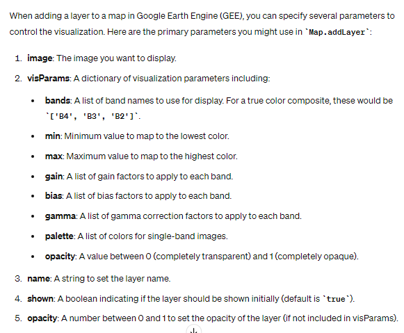

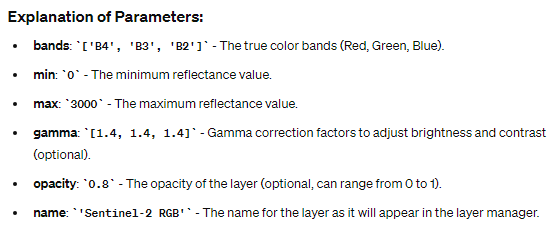

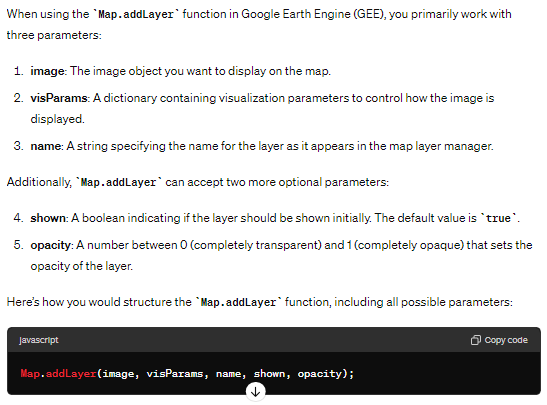

```js
//Navigate to area of interest
Map.setCenter(132.5685, -12.6312, 8);
// Select a specific Sentinel-2 image from the archive
// Print image details to the Console
var sent2 = ee.Image("COPERNICUS/S2/20180422T012719_20180422T012714_T52LHM");
// Print image details to the Console
print(sent2)

// Add RGB composite to map, without parameters defined, before adding min and max value
Map.addLayer(sent2,{bands:['B4','B3','B2']}, "Black Layer", false);

//Map.addLayer(image, { bands: ['B4', 'B3', 'B2'],min: 0,max: 0.3,palette: ['red', 'green', 'blue'],
// opacity: 0.8,name: 'Landsat 8 RGB'}); without adding max and min value the region appears black
//Reflectance values for Sentinel-2 products range from 0 to 3000
// a true color composite typically refers to an image that is displayed using the red, green, and 
// blue bands of the satellite sensor, corresponding to the way human eyes perceive color.
Map.addLayer(sent2, 
{
  bands: ['B4', 'B3', 'B2'],
  min: 0,
  max: 3000,
  // cannot apply palette when there is multiple bands
}, 'Sentinel-2 RGB True Color Composite', false);
```
Output:                                                            
Black Layer                          
                                                         
                                                                       True Color Composite                                   
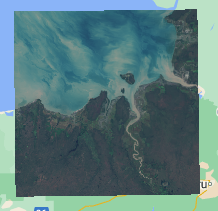

In a false color composite, near-infrared, shortwave infrared, and other non-visible wavelengths are mapped to visible colors (red, green, and blue) to enhance the visualization of certain features. For example, vegetation, water bodies, and urban areas can be more easily distinguished using false color composites.                                          

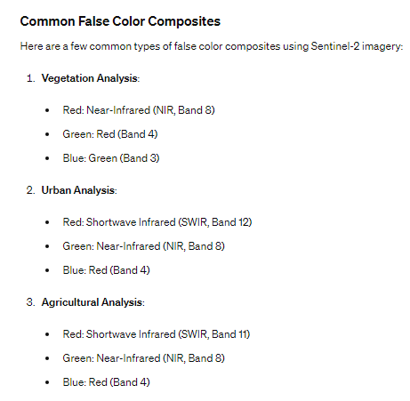                                            

False color composites are essential in remote sensing and Earth observation because they allow us to visualize and analyze features and phenomena that are not easily detectable in natural color (true color) images.                                                                                                                                        

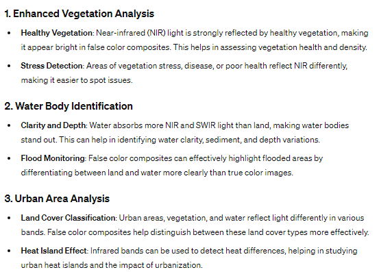                                                                                                                                        

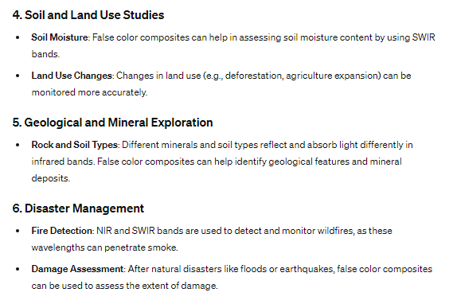                                                                   
```js
Map.addLayer(sent2, 
{
  bands: ['B8', 'B4', 'B3'],
  min: 0,
  max: 3000,
  // cannot apply palette when there is multiple bands
}, 'Sentinel-2 RGB False Color Composite', false); // false will uncheck the layers so user can add layer as per requirement
```
Output:                                                             
False color composite                                                           

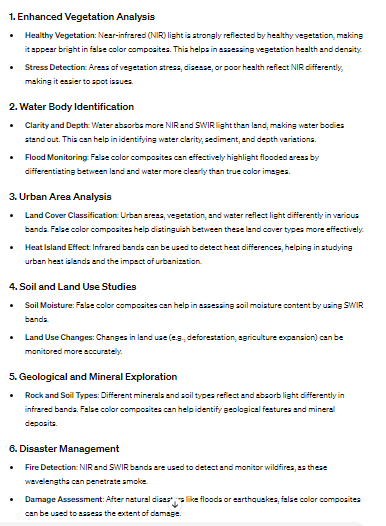                                            

To really build your understanding of how different wavelengths interact with surfaces, we are now going to load individual bands sequentially, from shorter to longer wavelengths. To display Band 1, the code is as follows:                                              

```js
Map.addLayer(sent2,{bands:['B1'], min:0, max:3000}, "Band B1", false);
Map.addLayer(sent2,{bands:['B4'], min:0, max:3000}, "B4", false);
Map.addLayer(sent2,{bands:['B8'], min:0, max:3000}, "B8", false);
Map.addLayer(sent2,{bands:['B12'], min:0, max:3000}, "B12", false);
```                                                                 
Output:                                                             
Band B1                                                                  

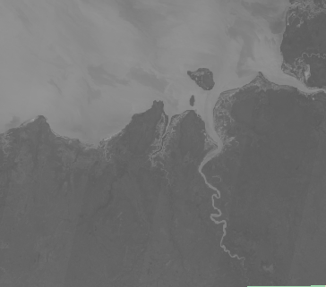                                          
 Band B4                                                                  
 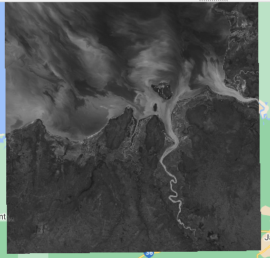                                              
 Band B8                                            
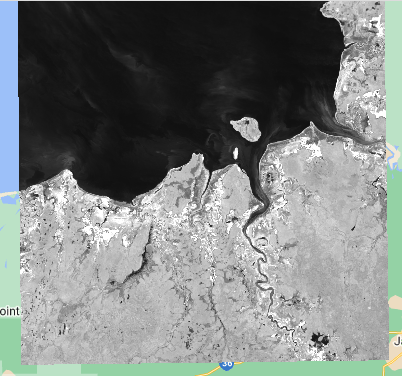                                           
Band B12                                                                
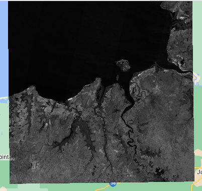


# Tutorial Lab 3
[[Click Here]](https://www.geospatialecology.com/intro_rs_lab3/) for google like of the lession                                                                 
Understanding spectral indices, each index is designed to highlight specific features on the Earth’s surface, such as vegetation health, water content, or soil properties.
For example, the Normalized Difference Vegetation Index (NDVI) measures the greenness of vegetation by comparing the reflectance of visible and near-infrared 

```js
//It is important to understand that we have now added access to the full Sentinel-2 image collection 
// (i.e. every image that has been collected to date) to our script, but we want only signgle cloude 
// free image from all the images; filter the image

var image = ee.Image(sent2 // defines variable to store result of following operations
.filterDate("2015-07-01", "2017-09-30") //sent2 referes to Sentinel-2 image collection object
.filterBounds(campus)
.sort("CLOUD_COVERAGE_ASSESSMENT")
.first());
```
Sentinel-2 data, CLOUD_COVERAGE_ASSESSMENT is not a function but a metadata property associated with the images. It provides a numerical value representing the percentage of the image that is covered by clouds. This property is used to assess the quality of the image in terms of cloud cover.


                                      

```js
var imageCollection = ee.ImageCollection('COPERNICUS/S2')
  .filterDate('2020-01-01', '2020-12-31')  // Filter by date range
  .filterBounds(campus)  // Filter by geographic region
  .filterMetadata('CLOUDY_PIXEL_PERCENTAGE', 'less_than', 10)  // Filter by cloud coverage
  .sort('SUN_ELEVATION', false)  // Sort by sun elevation
  .first();  // Select the first image in the sorted collection

print(imageCollection);

```
Metadata is like the “extra information” that comes along with any piece of data. It doesn’t contain the actual content, but it provides context and details about that content.                

Wherever you click on the image, the band values at that point will be displayed in the Inspector window. Click over some different patch types (sports fields, mangroves, ocean, beach, houses) to see how the spectral profile changes. In the inspector section will see change in bands in the form of Histogram in different scenerios.

```js
//To look at this image, we need to add it to our mapping environment.
//Code specifies that for a true colour image, bands 4,3 and 2 should be used in the RGB composite. 
// Sentinel-2 image, which is at 10m resolution for the selected bands
var trueColor = {
  bands: ["B4", "B3", "B2"],
  min: 0,
  max: 3000
};

// Add the image to the map, using visualiation parameters
Map.addLayer(image, trueColor, "True Color Image");
```
Output:                                                         

      
Now let's have a look at a false colour composite - we need to bring in the near-infrared band (band 8) for this.       

False-colour composites place the near infra-red band in the red channel, and we see a strong response to the chlorophyll content in green leaves. Vegetation that appears dark green in true colour, appearing bright red in the false-colour. Note the variations in red that can be seen in the vegetation bordering Rapid Creek. You will also see that "false-colour composite" has been added to the Layers tab in the map view.

```js
var falseColor = {
  bands: ["B8", "B4", "B3"],
  min: 0,
  max: 3000
};

// Add the image to the map, using visualiation parameters
Map.addLayer(image, falseColor, "False Color Image", false);
```
Output:                                                         


### Calculating NDVI
Next, let's calculate the normalised-difference vegetation index (NDVI) for this image. NDVI is an index calculated from the RED and NIR bands, according to this equation:                       
***NDVI = (NIR - RED)/(NIR + RED)***
```js
//Define variable NDVI from equation
var NDVI = image.expression(
        "(NIR - RED) / (NIR + RED)",
        {
          RED: image.select("B4"),    //  RED
          NIR: image.select("B8"),    // NIR
          BLUE: image.select("B2")    // BLUE
        });

    Map.addLayer(NDVI, {min: 0, max: 1}, "NDVI", false);
```
Output:                                                       


