# Google Earth Engine(Tutorial)
# Tutorial 2
[Click Here](https://www.geospatialecology.com/intro_rs_lab2/) for google like of the lession                                                        


```js
//Navigate to area of interest
Map.setCenter(132.5685, -12.6312, 8);
// Select a specific Sentinel-2 image from the archive
// Print image details to the Console
var sent2 = ee.Image("COPERNICUS/S2/20180422T012719_20180422T012714_T52LHM");
// Print image details to the Console
print(sent2)

// Add RGB composite to map, without parameters defined, before adding min and max value
Map.addLayer(sent2,{bands:['B4','B3','B2']}, "Black Layer", false);

//Map.addLayer(image, { bands: ['B4', 'B3', 'B2'],min: 0,max: 0.3,palette: ['red', 'green', 'blue'],
// opacity: 0.8,name: 'Landsat 8 RGB'}); without adding max and min value the region appears black
//Reflectance values for Sentinel-2 products range from 0 to 3000
// a true color composite typically refers to an image that is displayed using the red, green, and 
// blue bands of the satellite sensor, corresponding to the way human eyes perceive color.
Map.addLayer(sent2, 
{
  bands: ['B4', 'B3', 'B2'],
  min: 0,
  max: 3000,
  // cannot apply palette when there is multiple bands
}, 'Sentinel-2 RGB True Color Composite', false);
```
Output:                                                            
Black Layer                          
                                                         
                                                                       True Color Composite                                   


In a false color composite, near-infrared, shortwave infrared, and other non-visible wavelengths are mapped to visible colors (red, green, and blue) to enhance the visualization of certain features. For example, vegetation, water bodies, and urban areas can be more easily distinguished using false color composites.                                          

                                            

False color composites are essential in remote sensing and Earth observation because they allow us to visualize and analyze features and phenomena that are not easily detectable in natural color (true color) images.                                                                                                                                        

                                                                                                                                        

                                                                   
```js
Map.addLayer(sent2, 
{
  bands: ['B8', 'B4', 'B3'],
  min: 0,
  max: 3000,
  // cannot apply palette when there is multiple bands
}, 'Sentinel-2 RGB False Color Composite', false); // false will uncheck the layers so user can add layer as per requirement
```
Output:                                                             
False color composite                                                           

                                            

To really build your understanding of how different wavelengths interact with surfaces, we are now going to load individual bands sequentially, from shorter to longer wavelengths. To display Band 1, the code is as follows:                                              

```js
Map.addLayer(sent2,{bands:['B1'], min:0, max:3000}, "Band B1", false);
Map.addLayer(sent2,{bands:['B4'], min:0, max:3000}, "B4", false);
Map.addLayer(sent2,{bands:['B8'], min:0, max:3000}, "B8", false);
Map.addLayer(sent2,{bands:['B12'], min:0, max:3000}, "B12", false);
```                                                                 
Output:                                                             
Band B1                                                                  

                                          
 Band B4                                                                  
                                               
 Band B8                                            
                                           
Band B12                                                                


# Tutorial Lab 3
[[Click Here]](https://www.geospatialecology.com/intro_rs_lab3/) for google like of the lession                                                                 
Understanding spectral indices, each index is designed to highlight specific features on the Earth’s surface, such as vegetation health, water content, or soil properties.
For example, the Normalized Difference Vegetation Index (NDVI) measures the greenness of vegetation by comparing the reflectance of visible and near-infrared 
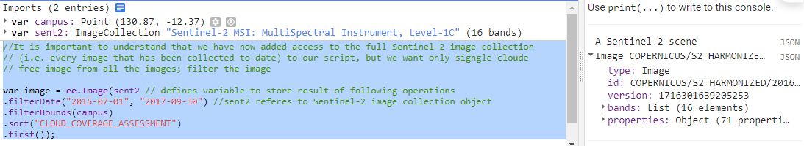
```js
//It is important to understand that we have now added access to the full Sentinel-2 image collection 
// (i.e. every image that has been collected to date) to our script, but we want only signgle cloude 
// free image from all the images; filter the image

var image = ee.Image(sent2 // defines variable to store result of following operations
.filterDate("2015-07-01", "2017-09-30") //sent2 referes to Sentinel-2 image collection object
.filterBounds(campus)
.sort("CLOUD_COVERAGE_ASSESSMENT")
.first());
```
Sentinel-2 data, CLOUD_COVERAGE_ASSESSMENT is not a function but a metadata property associated with the images. It provides a numerical value representing the percentage of the image that is covered by clouds. This property is used to assess the quality of the image in terms of cloud cover.

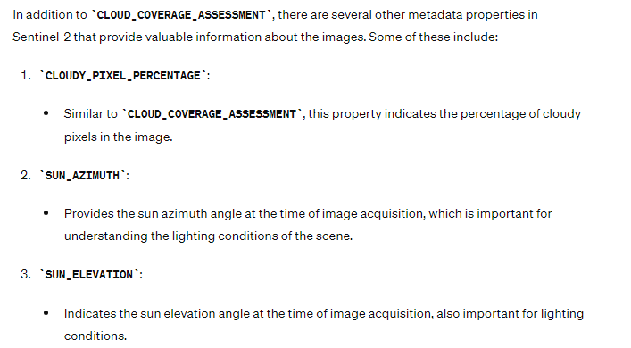
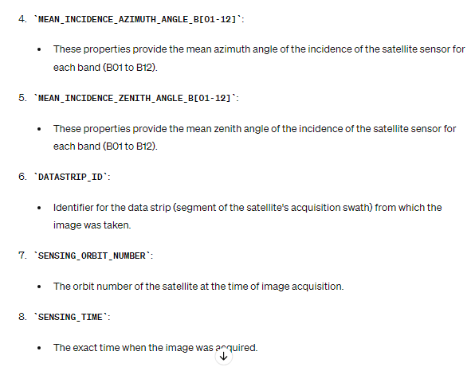                                      

```js
var imageCollection = ee.ImageCollection('COPERNICUS/S2')
  .filterDate('2020-01-01', '2020-12-31')  // Filter by date range
  .filterBounds(campus)  // Filter by geographic region
  .filterMetadata('CLOUDY_PIXEL_PERCENTAGE', 'less_than', 10)  // Filter by cloud coverage
  .sort('SUN_ELEVATION', false)  // Sort by sun elevation
  .first();  // Select the first image in the sorted collection

print(imageCollection);

```
Metadata is like the “extra information” that comes along with any piece of data. It doesn’t contain the actual content, but it provides context and details about that content.                

Wherever you click on the image, the band values at that point will be displayed in the Inspector window. Click over some different patch types (sports fields, mangroves, ocean, beach, houses) to see how the spectral profile changes. In the inspector section will see change in bands in the form of Histogram in different scenerios.

```js
//To look at this image, we need to add it to our mapping environment.
//Code specifies that for a true colour image, bands 4,3 and 2 should be used in the RGB composite. 
// Sentinel-2 image, which is at 10m resolution for the selected bands
var trueColor = {
  bands: ["B4", "B3", "B2"],
  min: 0,
  max: 3000
};

// Add the image to the map, using visualiation parameters
Map.addLayer(image, trueColor, "True Color Image");
```
Output:                                                         

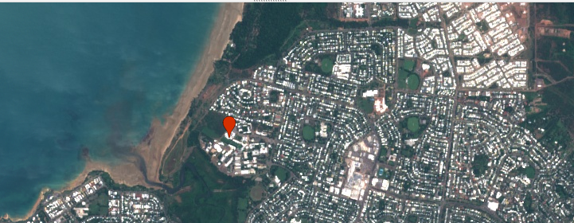      
Now let's have a look at a false colour composite - we need to bring in the near-infrared band (band 8) for this.       

False-colour composites place the near infra-red band in the red channel, and we see a strong response to the chlorophyll content in green leaves. Vegetation that appears dark green in true colour, appearing bright red in the false-colour. Note the variations in red that can be seen in the vegetation bordering Rapid Creek. You will also see that "false-colour composite" has been added to the Layers tab in the map view.

```js
var falseColor = {
  bands: ["B8", "B4", "B3"],
  min: 0,
  max: 3000
};

// Add the image to the map, using visualiation parameters
Map.addLayer(image, falseColor, "False Color Image", false);
```
Output:                                                         

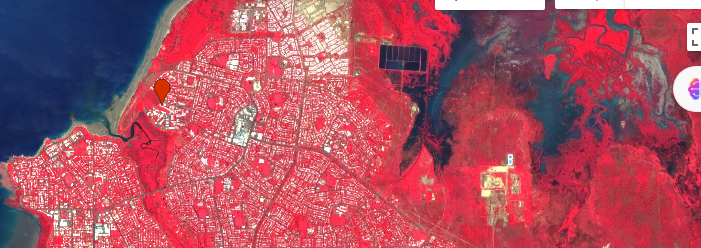

### Calculating NDVI
Next, let's calculate the normalised-difference vegetation index (NDVI) for this image. NDVI is an index calculated from the RED and NIR bands, according to this equation:                       
***NDVI = (NIR - RED)/(NIR + RED)***
```js
//Define variable NDVI from equation
var NDVI = image.expression(
        "(NIR - RED) / (NIR + RED)",
        {
          RED: image.select("B4"),    //  RED
          NIR: image.select("B8"),    // NIR
          BLUE: image.select("B2")    // BLUE
        });

    Map.addLayer(NDVI, {min: 0, max: 1}, "NDVI", false);
```
Output:                                                       
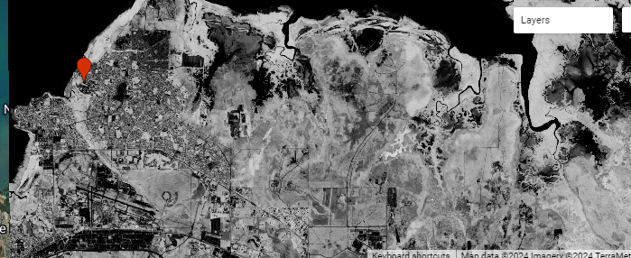

## YouTube Tutorial
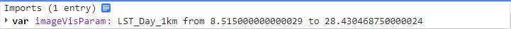
[Click Here](https://youtu.be/P5fgt_lr-HY?si=UVfleh_105uRlUTb) Youtube video like.
```js
// Initially make satellite view as default.
Map.setOptions('SATELLITE');

// Filter Bhutan border
var Bhutan_Border = ee.FeatureCollection("FAO/GAUL/2015/level0").filter(ee.Filter.eq("ADM0_NAME", "Bhutan"));

// Add Bhutan border to map
Map.addLayer(Bhutan_Border, {}, 'Bhutan Border');

// Filter Chukha district
var Dzongkhag = ee.FeatureCollection("FAO/GAUL/2015/level1").filter(ee.Filter.eq("ADM1_NAME", "Samtse"));

// Add Chukha district to map
Map.addLayer(Dzongkhag, {color: 'white'}, 'Dzongkhag');
Map.centerObject(Dzongkhag, 8)

//Importing the LST image collection, MODIS (Moderate Resolution Imaging Spectroradiometer) 
//Land Surface Temperature (LST) data. Importing daily land surface temperature data from the MODIS instrument
var modis =ee.ImageCollection("MODIS/061/MOD11A1")
.filterDate("2022-01-01", "2022-12-31")
.select('LST_Day_1km') //1km resolution data is selected form MODIS bands area

//converting image collection from kelvin to celcius for each images in the collection with function
 // modis.map will apply function taking  one argument to each image on modis varaible and store result 
 // in modis_kel_2_cel variable 
 var modis_kel_2_cel = modis.map(function(img) // defining anonymous function
 {
   return img
   .multiply(0.02) // Scaled Temperature=Original Temperature×0.02, given in MODIS band section
   .subtract(273.15)// Temperature in Celsius=Scaled Temperature−273.15
 // copy specific property from original image to new image, times stamp 
  // time at which the image is captured.
   .copyProperties(img, ['system:time_start'])
 });

// Create chart of LST temporal Analysis
var Time_Series_Chart = ui.Chart.image.series({// is function where drawing chart with series means bands
  imageCollection: modis_kel_2_cel, //which image data to display
  region: Dzongkhag,// ROI to display
  //reducers are used to aggregate or summarize data within a specified region and time period. 
  //particularly useful when working with image collections, as it allows you to condense the 
  // information from multiple images into a single value or set of values
  //Image collections can contain a large number of images, each with many pixels. Reducers enable us to 
  //summarize this wealth of data into a more manageable form, such as a single value per image or per time period.
  // By applying reducers, we can compute various statistics over the data, such as mean, sum, median, standard 
  // deviation, etc
  reducer: ee.Reducer.mean(), 
  scale: 1000, //converting km to meter
  xProperty: "system:time_start"}) 
  .setOptions({ //ets additional options for the chart.
    title: "LST Temporal Analysis",
    vAxis : {title : "LST Celcius"}
  })
print(Time_Series_Chart)

//Image visulization, one image at a time, will take mean value of the images
// So from Layout setting choose custom, stretch 100%, from pallet add multiple color of interest
// then it can be imported as library with name imageVisParam otherwise each time 
//code is rand have to add pallet. Map.addLayer(mean_image, {}, "Mean Image") was before importing imageVisParam
var mean_image = modis_kel_2_cel.mean().clip(Dzongkhag)

Map.addLayer(mean_image, imageVisParam, "Mean Image")

```
Output:      
Bhutan map with boundry for district level and international Border leve.                                                             
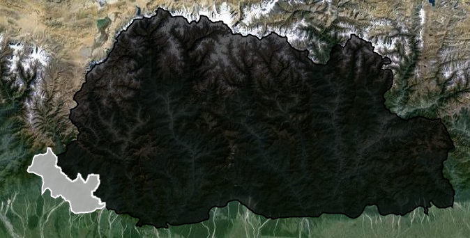                                                 

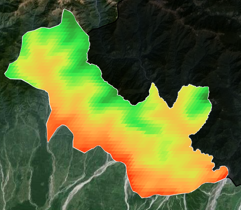

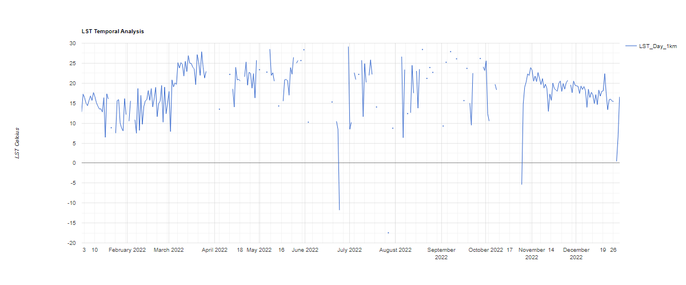

# Youtube video on Image Classification                                                                 

[Click Here](https://code.earthengine.google.com/) link for  google earth engine code                                                                                
```js
// get cloud free image form Landst 8 Surface Reflectance Tier 1
// filter to roi, filter to range ofdata, filter by cloud cover, select least cloud cover image
var image = ee.Image(ee.ImageCollection('LANDSAT/LC08/C01/T1_SR')
    .filterBounds(roi)
    .filterDate('2016-05-01', '2016-06-30')
    .sort('CLOUD_COVER')
    .first());
Map.addLayer(image, {bands: ['B4', 'B3', 'B2'],min:0, max: 3000}, 'True colour image');


//after collecting training data of diffifferent classes need to merge into single collection
// called FeatureCollection
var classNames = factory.merge(nonfactory);
print(classNames)

// use featurecollection to drill through image and extract the reflectance data for each point
// for every band
// create training data overlaying the training points on the image, adds new properties to the
// feature collection that represents image bands values at each point
var bands = ['B2', 'B3', 'B4', 'B5', 'B6', 'B7']
var training = image.select(bands).sampleRegions({
  collection: classNames,
  properties:['landcover'],
  scale: 30
});
print(training);
//can train the classifier algorithm by using our examples 
//of what different landcover class look like from a multi-spectral perspective.
var classifier = ee.Classifier.smileCart().train({
  features: training,
  classProperty: 'landcover',
  inputProperties: bands
});

//The next step is then to apply this knowledge from our training to the rest of the image - 
//using was was learnt from our supervised
//collection to inform decisions about which class other pixels should belong to.
//Run the classification
var classified = image.select(bands).classify(classifier);

//Display classification
Map.centerObject(classNames, 11);
Map.addLayer(classified,
{min: 0, max: 3, palette: ['red', 'blue']},
'classification');
```

# Supervised Image Classification Youtube Video
[Click Here](https://code.earthengine.google.com/) link for  google earth engine code                                                               

[Click Here](https://youtu.be/oMxRzB4mYV8?si=khynsdT3I22yJHJ0) link for youtube video part 1                                                                  

[Click Here](https://youtu.be/4jmq1o1EGG8?si=Em7qnuRIEoa-aDfy) link for  youtube video part 2                                                           

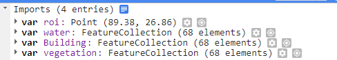

```js
// 1. Load Landsat 8 data for specific roi and specific data
// to perform Supervised Image Classification need to defined roi
// and load Landsat 8 image to google earth engine
// zoom into roi and from map area select add marker
var image = ee.ImageCollection('LANDSAT/LC08/C01/T1_SR')
  .filterDate('2021-01-01', '2021-01-31')
  .filterBounds(roi)
  .sort('CLOUD_COVER') // Sort by cloud cover percentage
  .first(); // Select the least cloud-covered image
// 2. set visulization parameter, 30m resolution
var visParaTrue = {bands: ['B4', 'B3', 'B2'], min: 0, max: 3000, gamma: 1.5};
// Add the image to the map
Map.addLayer(image, visParaTrue, "Landsat 8 True Color 2020", false);

// Center the map on the ROI with zoom level 8
Map.centerObject(roi, 8);

// 3. to perform supervised classification need to gather training data
// to gather trainig data go to Geometry Imports and add new layer, 
// while gathering training data the new added layer must be heighlight bold
// form setting figure go to configure geometry import, given name for each class
// import as  FeatureCollection and name properties common to all class and give
// values to identify each class

// 3. Create training data, importing trainig data to gee
var label = 'classValue';
var bands = ['B1', 'B2', 'B3', 'B4', 'B5', 'B7'];
// defining variable input to extract bands from Landsat image
var input = image.select(bands)

//4. To import training data to supervised classification need to merge
var training = vegetation.merge(water).merge(Building) 
// to visulize the training data, run code and in the console  see the result
// total 204 elements, click on features, click on feature (anyoneout of many)
// click on properties and will see classValue 
print(training)

//5. Overlay the points on image to get trainig data and to extract lansat 8 bands
var trainImage = input.sampleRegions({
  collection: training,
  properties : [label],
  scale: 30
  
})
//will be able to view bands along with features, click on features, click one
// of the band from many and click on properties, each image class will have band
// extracted form afformentioned bands
print(trainImage)

//6. Performe accuracy assissment of data before traning model
// using 80% for traning and 20% for validation
var trainData = trainImage.randomColumn(); // selects random column
var trainSet = trainData.filter(ee.Filter.lessThan('random', 0.8)); // training data
var testSet = trainData.filter(ee.Filter.greaterThanOrEquals('random', 0.8))// validation data

// 6. Classification performance/ classification model
// smileCart is regression classifier with decission tree algorithm
var classifier = ee.Classifier.smileCart().train(trainSet, label, bands);

//7. Classify the image in 4 classes
var classified = input.classify(classifier);
print(classified.getInfo()); //to print the details of the model/in colsole result will be displayed

//8.to visulize classified with differerent palette 
var landCoverPalette = [
  '#113aff', //water(0)
  '#cc3712', //Buildings(1)
  '#0fdc37',//vegetation(2)
  ];
Map.addLayer(classified, {palette: landCoverPalette,min: 0, max: 3}, 'Classification', false)

//9. Test the accuracy of the model
// perform accuracy assessment, classify testSet and get confusion Matrix
var confusionMatrix = ee.ConfusionMatrix(testSet.classify(classifier)
.errorMatrix({
  actual: 'classValue', //training data
  predicted: 'classification' 
}));

// result will be shown in the consoul section
print('Confusion Matrix:', confusionMatrix);
print('Overall Accuracy:', confusionMatrix.accuracy());
// how each class is accurately predicted by the model
print('Producers Accuracy:', confusionMatrix.producersAccuracy());
print('Consumers Accuracy:', confusionMatrix.consumersAccuracy());

//10. Export classified map to Google Drive
// to export the LandSat_8_Classified_CART to google drive, from Task run
Export.image.toDrive({
  image: classified,
  description: 'LandSat_8_Classified_CART',
  scale: 30,
  region: roi,
  maxPixels: 1e13
});

```
